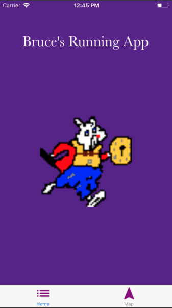
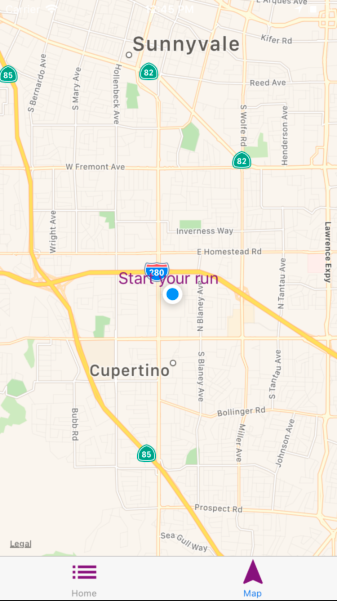
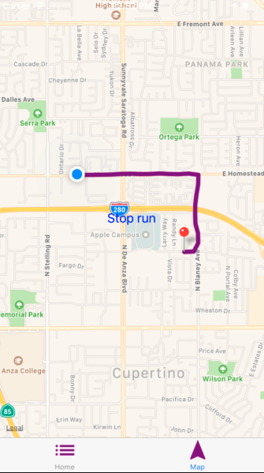

Welcome to the Bruce's Running App.

This app was built to track movement from point 'A' to point 'b'.

As a client, to use the app, click on 'Map' and click 'Start Your Run' to start tracking. Once you're run is over, click 'Stop Your Run'.






## Table of Contents

* [Updating to New Releases](#updating-to-new-releases)
* [Available Scripts](#available-scripts)
  * [npm start](#npm-start)
  * [npm test](#npm-test)
  * [npm run ios](#npm-run-ios)
  * [npm run android](#npm-run-android)
  * [npm run eject](#npm-run-eject)
* [Writing and Running Tests](#writing-and-running-tests)
* [Environment Variables](#environment-variables)
  * [Configuring Packager IP Address](#configuring-packager-ip-address)
* [Customizing App Display Name and Icon](#customizing-app-display-name-and-icon)
* [Sharing and Deployment](#sharing-and-deployment)
  * [Publishing to Expo's React Native Community](#publishing-to-expos-react-native-community)
  * [Building an Expo "standalone" app](#building-an-expo-standalone-app)
  * [Ejecting from Create React Native App](#ejecting-from-create-react-native-app)
    * [Build Dependencies (Xcode & Android Studio)](#build-dependencies-xcode-android-studio)
    * [Should I Use ExpoKit?](#should-i-use-expokit)
* [Troubleshooting](#troubleshooting)
  * [Networking](#networking)
  * [iOS Simulator won't open](#ios-simulator-wont-open)
  * [QR Code does not scan](#qr-code-does-not-scan)

## Available Scripts

If Yarn was installed when the project was initialized, then dependencies will have been installed via Yarn, and you should probably use it to run these commands as well. Unlike dependency installation, command running syntax is identical for Yarn and NPM at the time of this writing.

### `npm start`

Runs your app in development mode.

Open it in the [Expo app](https://expo.io) on your phone to view it. It will reload if you save edits to your files, and you will see build errors and logs in the terminal.

Sometimes you may need to reset or clear the React Native packager's cache. To do so, you can pass the `--reset-cache` flag to the start script:

```
npm start --reset-cache
# or
yarn start --reset-cache
```

#### `npm test`

Runs the [jest](https://github.com/facebook/jest) test runner on your tests.

#### `npm run ios`

Like `npm start`, but also attempts to open your app in the iOS Simulator if you're on a Mac and have it installed.

#### `npm run android`

Like `npm start`, but also attempts to open your app on a connected Android device or emulator. Requires an installation of Android build tools (see [React Native docs](https://facebook.github.io/react-native/docs/getting-started.html) for detailed setup). We also recommend installing Genymotion as your Android emulator. Once you've finished setting up the native build environment, there are two options for making the right copy of `adb` available to Create React Native App:

##### Using Android Studio's `adb`

1. Make sure that you can run adb from your terminal.
2. Open Genymotion and navigate to `Settings -> ADB`. Select “Use custom Android SDK tools” and update with your [Android SDK directory](https://stackoverflow.com/questions/25176594/android-sdk-location).

##### Using Genymotion's `adb`

1. Find Genymotion’s copy of adb. On macOS for example, this is normally `/Applications/Genymotion.app/Contents/MacOS/tools/`.
2. Add the Genymotion tools directory to your path (instructions for [Mac](http://osxdaily.com/2014/08/14/add-new-path-to-path-command-line/), [Linux](http://www.computerhope.com/issues/ch001647.htm), and [Windows](https://www.howtogeek.com/118594/how-to-edit-your-system-path-for-easy-command-line-access/)).
3. Make sure that you can run adb from your terminal.
